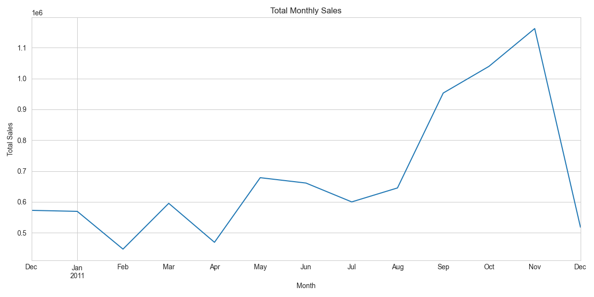
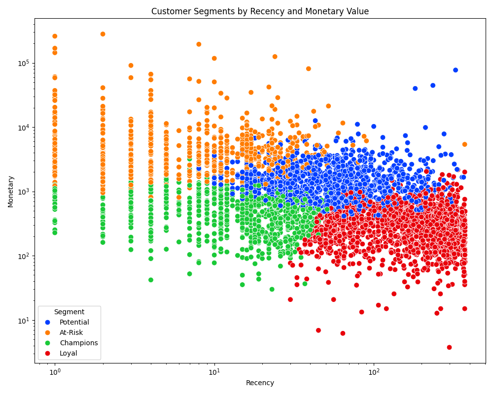

# End-to-End Retail Sales Analytics and Customer Segmentation


## 📖 Project Overview

This project provides a comprehensive end-to-end analysis of an online retail dataset. The primary objectives were to perform exploratory data analysis to uncover sales trends, and to leverage machine learning to segment customers into distinct groups for targeted marketing. The entire workflow, from data cleaning and database simulation to modeling and visualization, is documented.

---

## 🛠️ Tech Stack

* **Programming Language:** Python 3.8+
* **Libraries:** Pandas, NumPy, Matplotlib, Seaborn, Scikit-learn
* **Database:** sqlite3
* **BI Tool:** Power BI

---

## ⚙️ Project Workflow

1.  **Data Cleaning & Preprocessing:**
    * Loaded the dataset and handled missing `CustomerID` values.
    * Cleaned invoice data by removing cancellations.
    * Engineered a `TotalPrice` feature.

2.  **SQL Database Simulation:**
    * The cleaned data was loaded into a local MysQL database to simulate a real-world data environment.
    * SQL queries were used to extract aggregated and transactional data for analysis, demonstrating database querying skills.

3.  **Exploratory Data Analysis (EDA):**
    * Investigated key business metrics such as monthly sales trends, top-selling products, and sales distribution by country.
    * Generated visualizations to present findings clearly.

    

4.  **Customer Segmentation (RFM & K-Means):**
    * Calculated Recency, Frequency, and Monetary (RFM) values for each customer.
    * Applied K-Means clustering algorithm from `scikit-learn` to segment customers into distinct groups based on their purchasing behavior.
    * Analyzed and named the resulting segments (e.g., "High-Value Champions", "At-Risk Customers").

    

5.  **Interactive Dashboard:**
    * Developed an interactive dashboard in Power BI/Tableau to summarize the key insights from the analysis.
    * The dashboard includes KPIs, geographical sales data, and an interactive breakdown of customer segments.

---

## 🚀 How to Run

1.  Clone the repository:
    ```bash
    git clone [https://github.com/veeran177/Retail-Sales-Analytics.git](https://github.com/veeran177/Retail-Sales-Analytics.git)
    cd Retail-Sales-Analytics
    ```
2.  Install the required packages:
    ```bash
    pip install -r requirements.txt
    ```
3.  Run the Jupyter Notebooks in the `notebooks/` directory in sequential order (1, then 2, then 3).

